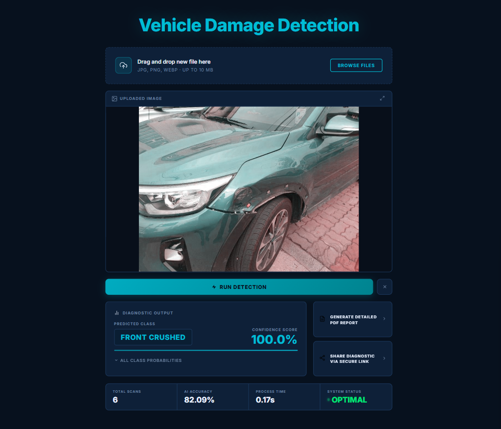

# Vehicle Damage Detection App

This app lets you drag and drop an image of a car and it will tell you what kind of damage it has. The model is trained on front and rear views, hence the picture should capture the front or rear view of a car.



## Model Details

1. Used ResNet50 for transfer learning.
2. Model was trained on around 1700 images with 6 target classes:
   - Front Normal
   - Front Crushed
   - Front Breakage
   - Rear Normal
   - Rear Crushed
   - Rear Breakage
3. The accuracy on the validation set was around 82%.
4. The backend is built using FastAPI and the frontend is built using React and Vite.

## Features

- **Instant Classification:** Model inference in under 0.2 seconds.
- **Confidence Scores:** Percentage breakdown for all 6 damage categories.
- **PDF Report Generation:** Download a professional diagnostic PDF report.
- **Shareable Link:** Generate a secure link to share prediction results.

## Set Up

To get started, you will need to start both the backend server and the frontend application.

### 1. Backend Setup

First, navigate to the backend directory, install the dependencies, and start the FastAPI server:

```bash
cd ui/backend
pip install -r requirements.txt

# Ensure your trained model (saved_model.pth) is placed inside the ui/backend/ folder.

uvicorn main:app --port 8000 --reload
```

The API will be available at http://localhost:8000.

### 2. Frontend Setup

Open a second terminal, navigate to the frontend directory, install the required packages, and run the development server:

```bash
cd ui/frontend
npm install
npm run dev
```

Open http://localhost:5173 in your browser to interact with the application.

## Important Note

The `saved_model.pth` file is too large to be tracked in git. You can train the model yourself using the Jupyter notebooks provided in the `training/` directory, or drop your pre-trained weights file directly into `ui/backend/` before running the API.
